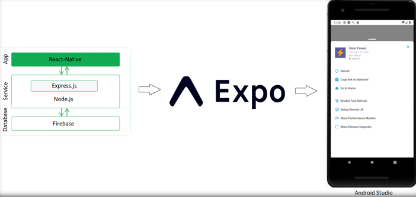

# Final Year Project
This repository contains my 4th year final year project. It is a React Native mobile application. The purpose of the mobile app is to allow gym goers to track their gym workouts.

## Run

How to run the project

1. Install Android Emulator (https://developer.android.com/studio) or Install Expo Go app on your mobile device 
2. Set up an emulator and start it
3. Clone the repository
4. Open the 'GymTrackerApp' folder in the terminal
5. Run 'npm install'
6. You can then open http://localhost:19002/ from there you can run the project on a emulator or scan the QR code with a physical device and open the mobile app on Expo Go

## Explore

In the GitHub repository you can also find other files such as `wireframe.PNG`, `Project Plan.docx`, `Dissertation.pdf` and `Project Slides.pptx`. Within those files you can find more information regarding the project.

## React Native

React Native is a frameowrk which allows you to build cross-platform applications for Android and Ios. My main development focus was on a Android application. I decided to use React Native as my framework of choice as after I had done research on it, it seemed like it would be a good fit for my project and is a very popular framework for mobile app development.

## Expo

Expo is a framework that is built on top of React Native it is a command line CLI it allows you to run your application on different emulators and it allow you to access your mobile app on your physical device using a QR code there are no cables required. Expo also allows you to by pass writing any native code so you can write one set of JavaScrip code which gets compiled and runs on Ios and Android devices.

## Contact

***

g00373428@gmit.ie